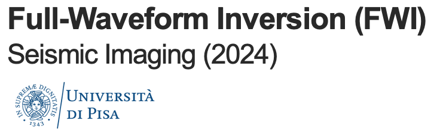

# Seismic Imagning 24
Course material for the lecture "Seismic Imagning" (2024) at the University of Pisa

[MSc. course In Exploration and Applied Geophysics](https://www.dst.unipi.it/home-wgf.html)

This is a computational exercise for a practical application of FWI and RTM using synthetic data.

This repository contains:
- A jupyter notebook with all the scripts and user functions to analyze the results. 
- A synthetic velocity model in .npy format.

Felipe Rincón
Italy, 30.04.2024
