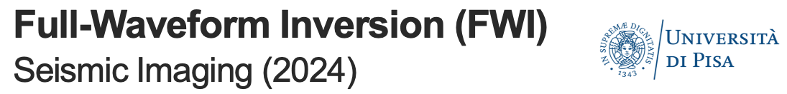
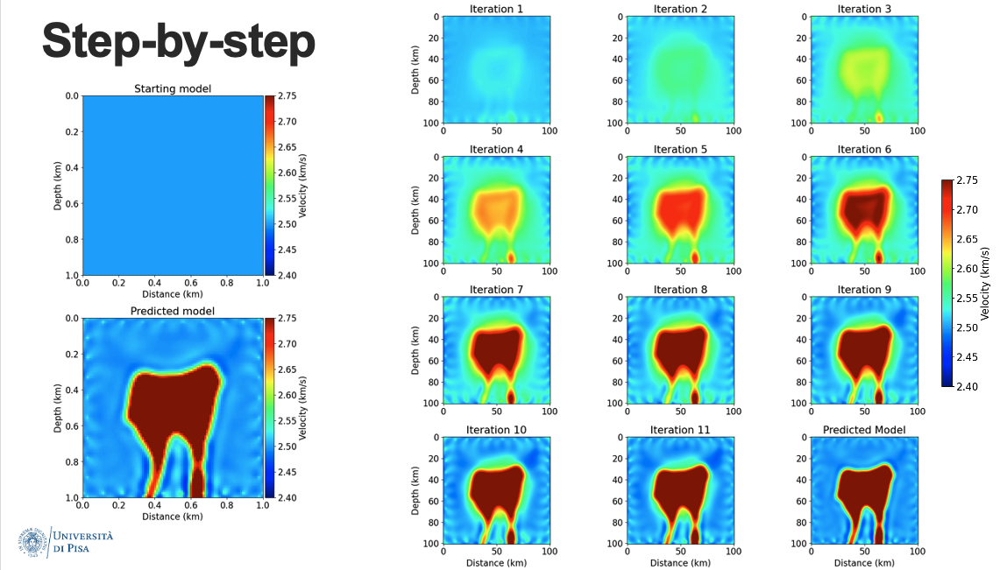

# Seismic Imagning 24 Edition
Course materials for the Seismic Imaging course (2024 Edition) taught by Professor Nicola Bienati at the University of Pisa.

[MSc. course In Exploration and Applied Geophysics](https://www.dst.unipi.it/home-wgf.html)

This is a computational exercise for a practical application of FWI and RTM using synthetic data.
Developed by Feliper Rincón at University of Pisa, Italy. 

If you have any questions, please contact Felipe by email: felipe.rincon@phd.unipi.it

This repository contains:
- A jupyter notebook with all the scripts and user functions to analyze the results. 
- A synthetic velocity model in .npy format.


Felipe Rincón

Italy, 30.04.2024


## Installation 
### Step 1:  Install [Devito](https://www.devitoproject.org/)
Installation steps are taken from the Devito repository. Please check the official page for alternative ways to install Devito.

The easiest way to try Devito is through Docker using the following commands:
```
# get the code
git clone https://github.com/devitocodes/devito.git
cd devito

# start a jupyter notebook server on port 8888
docker-compose up devito
```
After running the last command above, the terminal will display a URL such as
`https://127.0.0.1:8888/?token=XXX`. Copy-paste this URL into a browser window
to start a [Jupyter](https://jupyter.org/) notebook.

[See here](http://devitocodes.github.io/devito/download.html) for detailed installation
instructions and other options.

### Step 2:  Download the scripts
```
# get the code
git clone https://github.com/lfrincond/seismic_imaging_course.git
cd seismic_imaging_course
```

## Use this exercise to understand some basic concepts behind FWI and RTM 


